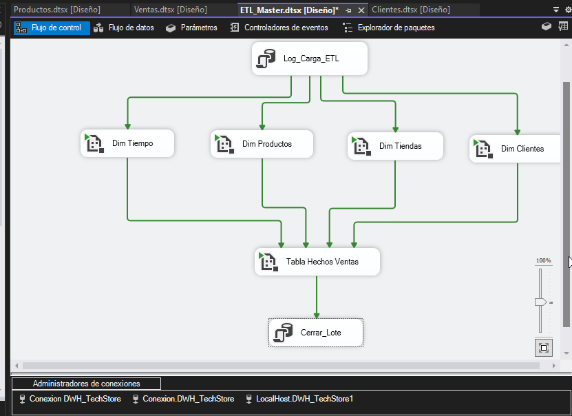

# DWH TechStore

Proyecto de data engineering para implementar un Data Warehouse corporativo con arquitectura por capas, modelo dimensional en estrella y cargas automatizadas. Diseñado para ofrecer analítica confiable de ventas, productos, clientes y tiendas.

---

## Problemática

Los sistemas operacionales son heterogéneos y presentan inconsistencias en formatos, tipos y dominios categóricos. Esto provoca duplicados, fechas mal tipadas y falta de trazabilidad histórica, lo que dificulta el análisis confiable y la toma de decisiones estratégicas. Se requiere un DWH por capas y procesos ETL robustos que garanticen calidad, rendimiento y auditabilidad.

---

## 🎯 Objetivos

- **Integración de datos** consolidando ventas, productos, clientes y tiendas.  
- **Calidad y consistencia** mediante normalización, deduplicación y conversiones en ODS.  
- **Historización** de dimensiones con SCD2 para preservar cambios en el tiempo.  
- **Automatización** de cargas y orquestación con SSIS, con manejo de errores y auditoría.

---

## 📦 Alcance

- **Dimensiones**: DimProducto, DimCliente, DimTienda, DimTiempo (SCD2).  
- **Hecho**: FactVentas con llaves surrogate y métricas de negocio (p. ej., MontoTotal).  
- **ETL**: Paquete maestro y flujos por entidad (Productos, Clientes con CDC, Tiendas, Tiempo, Ventas).  
- **Validaciones**: Checks de integridad, conteos poscarga y verificación de historización.

---

## 🧱 Arquitectura

```plaintext
                ┌────────────────────────────┐
                │   Fuentes operacionales    │
                │  (Ventas, Productos,       │
                │   Clientes, Tiendas)       │
                └─────────────┬──────────────┘
                              │
                              ▼
                ┌────────────────────────────┐
                │          STAGING           │
                │  Ingesta cruda y preserva  │
                │  del raw source            │
                └─────────────┬──────────────┘
                              │
                              ▼
                ┌────────────────────────────┐
                │           ODS              │
                │  Normalización, limpieza,  │
                │  conversiones, deduplicado │
                │  Reglas de negocio         │
                └─────────────┬──────────────┘
                              │
                              ▼
                ┌────────────────────────────┐
                │           BDS              │
                │  Modelo estrella:          │
                │  Dimensiones + FactVentas  │
                │  Índices y optimizaciones  │
                └────────────────────────────┘
```
---

## 🛠 Tecnologías

SQL Server para DWH y almacenamiento.

SSIS para orquestación y paquetes ETL.

T-SQL para transformaciones y validaciones.

SCD2 / CDC para historización e ingestión incremental.

---

## 🖼 Imágenes

### Control Flow ETL Maestro 

### Data Flow Ventas 

---

## 👤 Autor
Angel Teodoro Jaramillo Sulca Data engineer 